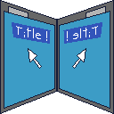

# chrome-extension-mirror

This extension supports working in multiple chrome tabs at once.  

The intentional idea of this extension is to compare the behavior of two websites by performing actions just once.  
This is useful for validating release candidates against the current live version of a website. 

## How to contribute
1. checkout this repo
2. open chrome 
3. navigate to **chrome://extensions**
4. turn on **developer mode**
5. press **load unpacked extensions**
6. choose the projects folder

## Basic idea and functionality:
The goal of this extension is to capture all user events on one page tab and mirror them in different page tab.
So basically this extension need to to 3 things:
 1. listen to events to capture them
 2. send the captured events to another page tab
 3. dispatch the events inside the other page tab

### Project Structure
In this chrome extensions those steps are quite symetrically solved.
In the folder content you will find some scripts where two are important:
 * eventCapturing.js (step 1 above)
 * eventDispatching.js (step 3 above)

In the background folder you will find antoher important script:
* eventBroadcasting.js (step 2 above)

### Functionality
Basic functionality explained by example:

Assume the user clicks on a button.

 1. **eventCapturing.js**: the event is captured by the 'click-listener' and is then send to the background-script
 2. **backgroundscript.js**: receives the event-information looks for target tabs and then broadcasts the event to the content-script eventDispatching.js
 3. **eventDispatching.js**: when the event is received the script tries to find the element by path and the dispatches the event on that element

## Tutorials 
very good kick-off tutorial about **developing chrome extensions**:
http://code.tutsplus.com/tutorials/developing-google-chrome-extensions--net-33076

Another very good tutorial about **event capturing and bubbling**:
https://www.kirupa.com/html5/event_capturing_bubbling_javascript.htm
